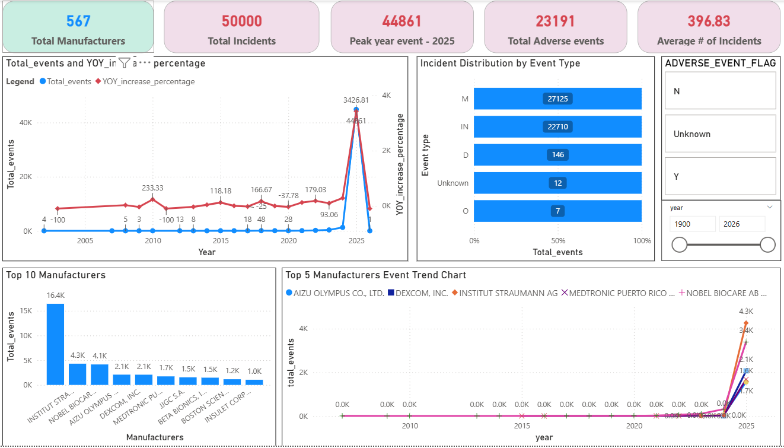

# Project Overview

This project analyzes medical device incident reports to identify trends, risk concentration, and manufacturer contribution to total incidents. An interactive Power BI dashboard was developed to monitor incident patterns, evaluate safety risks, and enable data-driven decision-making.

The analysis focuses on identifying high-risk manufacturers, understanding incident trends over time, and evaluating the distribution of different event types such as malfunctions, injuries, and deaths.

-- Objectives

- Analyze incident trends over time
- Identify manufacturers contributing most to incidents
- Measure incident concentration and risk distribution
- Evaluate contribution of different event types
- Build an interactive dashboard for incident monitoring

-- Report details

- The dataset includes thousands of incident records spanning multiple years.

-- Tools and Technologies Used

- Power BI – Dashboard development and visualization
- DAX – Calculated measures and KPI metrics
- SQL – Data extraction and preprocessing
- Power Query – Data cleaning and transformation
  
-- Key Features of Dashboard

- KPI cards showing total incidents, adverse events, and key metrics
- Trend analysis showing incident growth over time
- Top 5 manufacturers contributing highest incidents
- Event type distribution and percentage contribution
- Interactive slicers for year, and event type

-- Key Insights

- Top 5 manufacturers contribute 28.63% of total incidents, indicating risk concentration
- Incident trends show variation across years with identifiable peak periods
- Malfunctions account for the majority of reported incidents
- Incident distribution is uneven, with few manufacturers contributing disproportionately
- Adverse events constituted a major proportion (45.71%) of total incidents, indicating critical safety concerns requiring focused monitoring.

-- Skills Demonstrated

- Data cleaning and preprocessing
- Data analysis and interpretation
- Dashboard design and data visualization
- DAX measure creation and filter context handling
- Business insight generation from raw data

-- Project Structure
  Medical_Device_Incident_Analysis/
  Dashboard.pbix
  dataset.csv
  README.md

-- Business Value

This dashboard helps identify high-risk manufacturers and monitor incident trends, supporting proactive risk management and safety monitoring.
